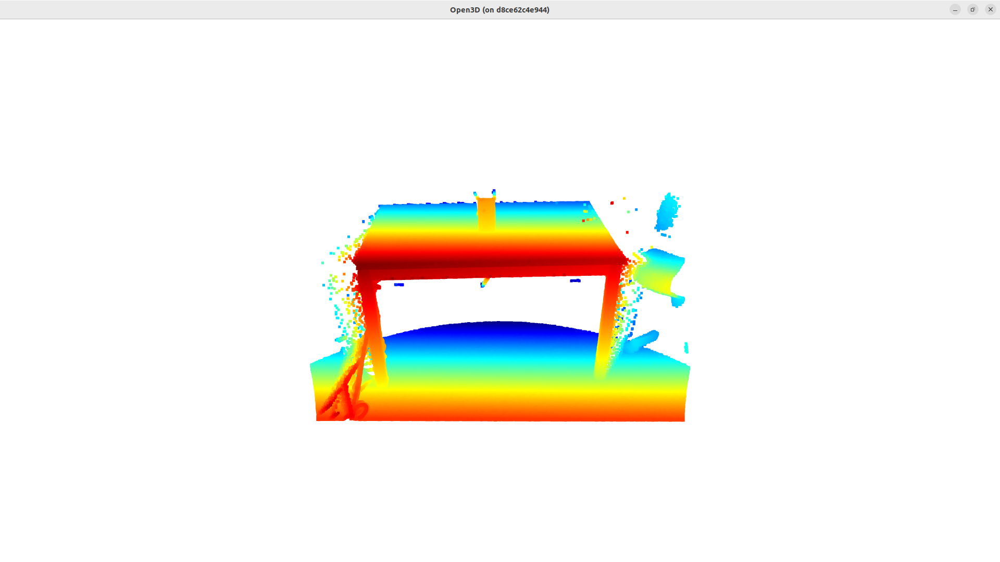

# robot_solution
3D point cloud 노이즈 제거 및 2D 투영 시스템 개발 

## 개요
- 3D point cloud 데이터의 노이즈 제거
- 3D point cloud를 2D 이미지로 투영하여 depth map과 heat map 생성
- YAML 파일을 통해 프로그램 설정 지정
- 함수 동작에 따른 로그 출력 및 저장

## 개발 환경 구성
Build docker image (based on ubuntu 22.04, python 3.10.12):
```
git clone https://github.com/jstar0525/robot_solution.git
cd ./robot_solution
docker build -t aiv:coding_test .
```

## 실행 방법
open3d의 3D pont cloud를 시각화 하기 위해 X서버 호스트 접근 제어 허용
```
xhost +
```
아래의 명령을 통해 생성된 도커 이미지를 컨테이너로 실행
```
docker run -it \
    -v /etc/localtime:/etc/localtime:ro \
    -e TZ=Asia/Seoul \
    -e QT_X11_NO_MITSHM=1 \
    -v /tmp/.X11-unix:/tmp/.X11-unix:rw \
    -e DISPLAY=$DISPLAY \
    -v /home/jstar/test:/home/jstar/test \
    aiv:coding_test
```
아래의 명령을 통해 프로그램 실행
```
cd /home/robot/robot_solution
python3 ./main.py
```
## 결과

### 3D point cloud 노이즈 제거

- 기존 3D point cloud  


- 노이즈 제거 후 이미지  


### 3D point cloud를 2D 이미지로 투영

- 투영한 heat map  
